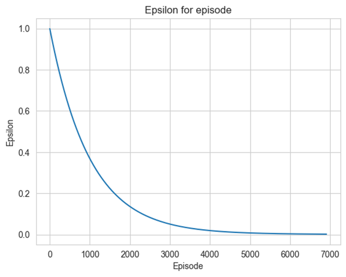
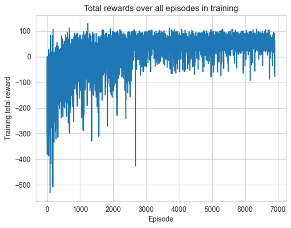
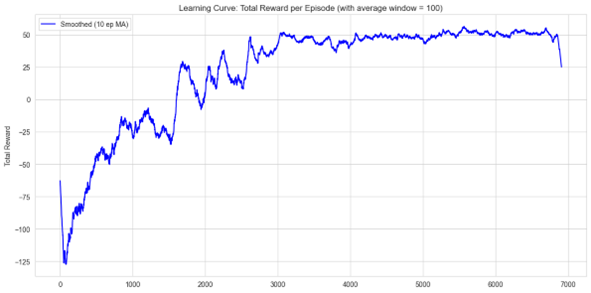

# Q-learning algorithm for LunarLander problem

<h2>Description:</h2>

The experiment is about finding a solution of Lunar Lander problem with the help of Q-learning algorithm from OpenAI gym environment.
Each training requires setting several hyperparameters like minimum and maximum value of epsilon coefficient, learning rate,
discount factor, maximum number of steps in each episode and number of bins used for discretization of observation space.
During training it is possible to track results as an average value of training rewards in each episode.
There are two available modes of learning rate value – constant value and adaptable value based on the number of visits to a given state
<em>α=60/(59+n)</em>
where:
n – number of visit in the appropriate state
There are also two possible modes of binning mode: adaptive and non-adaptive. In the first case, the initial observation space was divided evenly. Otherwise, it is possible to provide the specific observation space e.g. obtained from the previous trainings.
The important parameter of training process is the final difference (diff). The loop is carried out until the difference between current value of epsilon and minimal value of epsilon is greater than mentioned parameter.

<h2>Sample characteristics obtained </h2>

<h3>Characteristic of epsilon for all episodes </h3>

<h3>Characteristic of total rewards over all episodes</h3>

<h3>Smoothed characteristic of total rewards over all episodes</h3>
